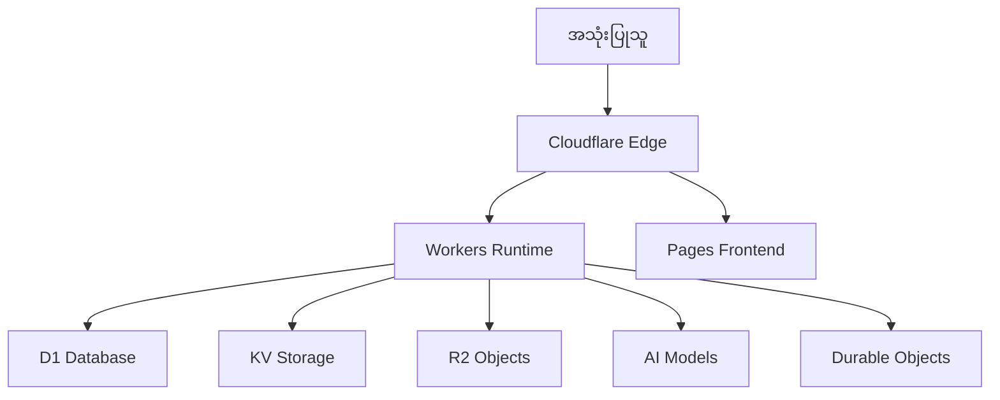

# 🚀 MMNext Enterprise POS

<div align="center">


**Cloudflare ၏ Edge Platform ပေါ်တွင် အပြည့်အဝ တည်ဆောက်ထားပြီး AI နည်းပညာများ ပါဝင်သော ၁၀၀% အခမဲ့ Enterprise အဆင့်မီ အရောင်းစီမံခန့်ခွဲမှုစနစ် (Point of Sale)**

[🌟 Demo စမ်းသပ်ရန်](https://pos-demo.pages.dev) | [📖 စနစ်အသုံးပြုပုံ လမ်းညွှန်](./docs/) | [🐛 အမှားအယွင်းများတင်ပြရန်](https://github.com/thihakyaw-leo/mmnext-enterprise-pos/issues) | [💬 ဆွေးနွေးရန်](https://github.com/thihakyaw-leo/mmnext-enterprise-pos/discussions)

</div>

---

## ✨ **အဓိက လုပ်ဆောင်ချက်များ (Features Overview)**

<table>
<tr>
<td width="50%">

### 🔐 **ရာထူးအလိုက် ဝင်ရောက်ခွင့် ထိန်းချုပ်ခြင်း**
- **Admin**: စနစ်တစ်ခုလုံးကို စီမံခန့်ခွဲနိုင်ခြင်း
- **Manager**: လုပ်ငန်းလည်ပတ်မှုများကို ကြီးကြပ်နိုင်ခြင်း
- **Cashier**: အရောင်းကောင်တာ လုပ်ငန်းစဉ်များ
- **Staff**: အရောင်း နှင့် Gamification (ဂိမ်းဆန်ဆန် ဆုပေးစနစ်)
- ရာထူးအဆင့် **၁၀ မျိုး** နှင့် လုပ်ပိုင်ခွင့် (Permissions) **၁၀၀ ကျော်**

### 🛒 **အချိန်နှင့်တပြေးညီ အရောင်းကောင်တာ (Real-time POS)**
- အလွန်မြန်ဆန်သော ငွေရှင်းစနစ်
- အင်တာနက်မရှိလည်း အလုပ်လုပ်နိုင်သော **Offline-first** PWA ဒီဇိုင်း
- Barcode ဖတ်စနစ်
- ငွေချေစနစ် မျိုးစုံကို လက်ခံနိုင်ခြင်း
- ငွေခွဲရှင်းခြင်း (Split payments) နှင့် ကြိုတင်မှာယူခြင်း (Layaway)
- **AI-အခြေခံ** ပစ္စည်းအကြံပြုချက်များ

### 📦 **စမတ်ကျသော ကုန်ပစ္စည်းစာရင်း စီမံခန့်ခွဲမှု**
- လက်ကျန်စာရင်းကို အချိန်နှင့်တပြေးညီ ကြည့်ရှုနိုင်ခြင်း
- **AI ဖြင့် ဝယ်လိုအား ခန့်မှန်းခြင်း**
- အလိုအလျောက် ပစ္စည်းပြန်လည်မှာယူမှု စနစ်
- ဂိုဒေါင်မျိုးစုံ အသုံးပြုနိုင်ခြင်း
- ပစ္စည်းအဝင်အထွက် မှတ်တမ်းများ

</td>
<td width="50%">

### 👥 **အဆင့်မြင့် ဖောက်သည်စီမံခန့်ခွဲမှု (CRM)**
- ဖောက်သည်များ၏ ကိုယ်ရေးအချက်အလက်နှင့် ဝယ်ယူမှုမှတ်တမ်းများ
- **အမှတ်ပေးစနစ် (Loyalty points)**
- မွေးနေ့ နှင့် နှစ်ပတ်လည် မှတ်တမ်းများ
- **AI ဖြင့် ဖောက်သည်များကို အမျိုးအစားခွဲခြားခြင်း**
- Marketing အလိုအလျောက် လုပ်ဆောင်ခြင်း

### 🎮 **ဝန်ထမ်းများအတွက် Gamification စနစ်**
- ရရှိထားသော **အောင်မြင်မှုတံဆိပ်များ (Badges)**
- အချိန်နှင့်တပြေးညီ **အဆင့်သတ်မှတ်ချက်များ (Leaderboards)**
- အဖွဲ့လိုက် ပြိုင်ပွဲများ
- **ကော်မရှင် မှတ်တမ်းများ**
- စွမ်းဆောင်ရည် သုံးသပ်ချက်များ

### 📊 **လုပ်ငန်းဆိုင်ရာ ဉာဏ်ရည်တု (Business Intelligence)**
- အချိန်နှင့်တပြေးညီ Dashboard
- **AI မှတဆင့် အကြံဉာဏ်ပေးမှုများ**
- စိတ်ကြိုက် Report များ ဖန်တီးနိုင်ခြင်း
- အရောင်း ခန့်မှန်းတွက်ချက်ခြင်း
- အမြတ်အစွန်း လေ့လာဆန်းစစ်ခြင်း
- ဆိုင်ခွဲများအကြား နှိုင်းယှဉ်လေ့လာနိုင်ခြင်း

</td>
</tr>
</table>

---

## 🏗️ **တည်ဆောက်ပုံ (Architecture)**

### **🌐 Edge-First Design**
အကောင်းဆုံး စွမ်းဆောင်ရည်နှင့် ယုံကြည်စိတ်ချရမှုအတွက် **Cloudflare ၏ ကမ္ဘာလုံးဆိုင်ရာ Edge Network** ပေါ်တွင် အပြည့်အဝ တည်ဆောက်ထားပါသည်။



### **⚡ နည်းပညာများ (Technology Stack)**

| အပိုင်း | အသုံးပြုထားသော နည်းပညာ | ရည်ရွယ်ချက် |
|-----------|------------|---------|
| **Runtime** | Cloudflare Workers | Edge computing နှင့် API |
| **Database** | Cloudflare D1 (SQLite) | အချက်အလက်များ သိမ်းဆည်းရန် |
| **Cache** | Cloudflare KV | Session နှင့် Config အချက်အလက်များ |
| **Storage** | Cloudflare R2 | ဖိုင်များ သိမ်းဆည်းရန် |
| **AI** | Cloudflare AI | Machine learning အတွက် |
| **Real-time** | Durable Objects | WebSocket connections |
| **Frontend** | React 18 + Vite | ခေတ်မီ UI |
| **UI Library** | Ant Design | Enterprise UI Components |
| **PWA** | Service Workers | Offline ဖြင့် အသုံးပြုရန် |

---

## 🚀 **အမြန်စတင်နည်း (Quick Start)**

### **📋 လိုအပ်ချက်များ (Prerequisites)**
- **Node.js** 18+ နှင့် npm 9+
- **Cloudflare account** (အခမဲ့ အကောင့်)
- **Git**

### **⚡ တစ်ချက်နှိပ်ရုံဖြင့် ထည့်သွင်းခြင်း (One-Command Setup)**

```bash
# Clone လုပ်ပြီး Setup လုပ်ရန်
git clone https://github.com/thihakyaw-leo/mmnext-enterprise-pos.git
cd mmnext-enterprise-pos
chmod +x scripts/setup.sh && ./scripts/setup.sh
```

### **🔧 ကိုယ်တိုင် ထည့်သွင်းနည်း (Manual Setup)**

<details>
<summary>ကိုယ်တိုင် ထည့်သွင်းမည့် အဆင့်များကို ကြည့်ရန်</summary>

```bash
# ၁. Dependencies များသွင်းရန်
npm install

# ၂. Cloudflare CLI ထည့်သွင်းရန်
npm install -g wrangler
wrangler login

# ၃. Environment သတ်မှတ်ရန်
cp .env.example .env
# .env ဖိုင်ထဲတွင် Cloudflare credentials များကို ပြင်ဆင်ထည့်သွင်းပါ

# ၄. Database တည်ဆောက်ရန်
npm run migrate
npm run seed

# ၅. Development Server စတင်ရန်
npm run dev
```

</details>

### **🌐 စနစ်သို့ ဝင်ရောက်ခြင်း**

- **Frontend**: http://localhost:5173
- **Backend API**: http://localhost:8787
- **Admin ဝင်ရန် အကောင့်**: `admin@pos.com` / `admin123`

---

## 💰 **၁၀၀% အခမဲ့ - Cloudflare Free Tier အသုံးပြုမှု**

| ဝန်ဆောင်မှု | အခမဲ့ ကန့်သတ်ချက် | POS တွင် အသုံးပြုမှု |
|---------|-----------------|----------------------|
| **Workers** | 100K requests/နေ့ | API endpoints |
| **D1 Database** | 5GB + 5M reads/နေ့ | ပစ္စည်း၊ အော်ဒါ၊ ဖောက်သည် အချက်အလက်များ |
| **KV Store** | 100K reads/နေ့ + 1GB | Sessions, settings, cache |
| **R2 Storage** | 10GB + 1M operations | ဓာတ်ပုံ၊ ဖြတ်ပိုင်း၊ Backup ဖိုင်များ |
| **Pages** | Unlimited bandwidth | Frontend Hosting |
| **AI** | 10K neurons/နေ့ | အကြံပြုချက်များနှင့် ခန့်မှန်းတွက်ချက်မှုများ |

> **💡 အသင့်တော်ဆုံးလုပ်ငန်းများ**: လုပ်ငန်းငယ်မှ အလတ်စားများ၊ Startups များ

---

## 📁 **Project ဖွဲ့စည်းပုံ (Structure)**

```text
mmnext-enterprise-pos/
├── 📱 frontend/                 # React PWA
│   ├── src/
│   │   ├── auth/               # အကောင့်ဝင်စနစ်များ
│   │   ├── components/         # ပြန်လည်အသုံးပြုနိုင်သော Components များ
│   │   ├── pages/              # ရာထူးအလိုက် စာမျက်နှာများ
│   │   │   ├── admin/          # 👑 Admin စာမျက်နှာ
│   │   │   ├── cashier/        # 💰 POS အရောင်းကောင်တာ
│   │   │   └── staff/          # 🎮 Gamification အပိုင်း
│   │   ├── services/           # API ချိတ်ဆက်မှုများ
│   └── public/                 # ပုံနှင့် Assets များ
│
├── ⚙️ backend/                  # Cloudflare Workers
│   ├── src/
│   │   ├── routes/             # API လမ်းကြောင်းများ
│   │   ├── middleware/         # Auth, CORS စသည်တို့
│   │   └── services/           # လုပ်ငန်းစဉ်ဆိုင်ရာ Logic များ
│   ├── database/               # Database Schema
│   └── wrangler.toml           # Cloudflare Config
│
├── 📚 docs/                     # Documentation လမ်းညွှန်စာအုပ်
├── 🛠️ scripts/                 # အလိုအလျောက် Automation Scripts
└── 📋 package.json              # Main Configuration ဖိုင်
```

---

## 🤝 **ပါဝင်အားဖြည့်ရန် (Contributing)**

ကျွန်ုပ်တို့၏ [Contributing Guide](./CONTRIBUTING.md) တွင် ဝင်ရောက်လေ့လာပြီး ပါဝင်အားဖြည့်နိုင်ပါသည်။

---

## 💬 **အကူအညီနှင့် အကြံပြုချက်များ (Support)**

- 🐛 [အမှားအယွင်းများ (Bugs) တင်ပြရန်](https://github.com/thihakyaw-leo/mmnext-enterprise-pos/issues)
- 💡 [လုပ်ဆောင်ချက်အသစ်များ အကြံပြုရန်](https://github.com/thihakyaw-leo/mmnext-enterprise-pos/discussions)
- ❓ [မေးခွန်းများမေးရန်](https://github.com/thihakyaw-leo/mmnext-enterprise-pos/discussions/categories/q-a)

---

<div align="center">

**Built with ❤️ using Cloudflare Workers**

[](https://cloudflare.com)
[](https://reactjs.org)
[](https://typescriptlang.org)

[⬆ အပေါ်သို့ ပြန်တက်ရန်](#-mmnext-enterprise-pos)

</div>
